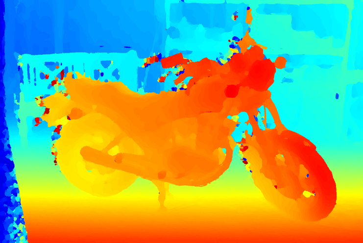
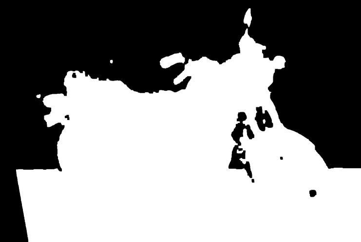
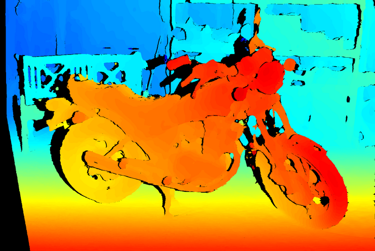
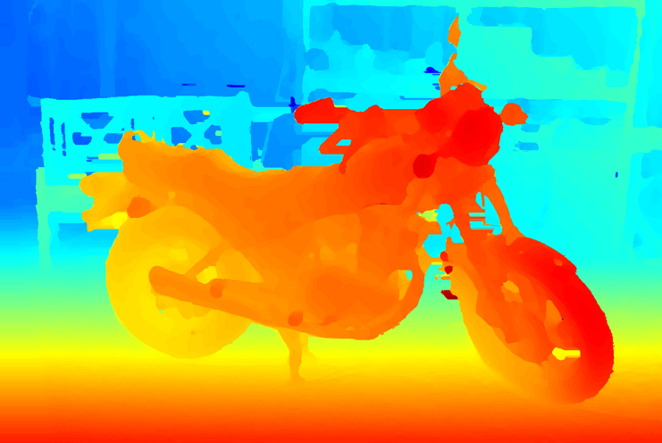

# FC-DCNN2


Updated version of the FC-DCNN network.
The updates to the network are as follows: 

- color-patches are used instead of grayscale patches. This increases the complexity by about +1k parameters.
- TanH after output-layer removed
- during training:
  - patch-size has been increased from 11x11 to 21x21 
  - range for positive/negative patch has been increased from [2,6] to [1,25]
- new datasets:
  - KITTI has been trained seperately (2012, 2015)
  - Sintel has been added
  - drivingStereo has been added

#### A densely connected neural network for stereo estimation
Dominik Hirner, Friedrich Fraundorfer

An pytorch implementation of a lightweight fully-convolutional densely connected neural network method for disparity estimation.
This method has been accepted and will be published at the **ICPR 2020** conference. If you use our work please cite our 
[paper](https://arxiv.org/abs/2010.06950)

A demo of this network is available online in Google Colab. 
[Demo](https://colab.research.google.com/drive/1i5k-YTCsmQC8IIURBh802oKeyZP_ZSHG)

The whole project is in pure python 3.6.

This repository contains

- jupyter notebooks for training and inference of disparity via a stereo-pair
- python3.6 code for training and inference
- trained weights for many publicly available datasets

The network was trained and tested on a GeForce RTX 2080 with 11GB of RAM.
The code is released under the BSD 2-Clause license. Please cite our paper (link) if you use code from this repository in your work.

## New trained weights

[Middlebury](https://drive.google.com/file/d/17LGGTQ0trAQs3qA05ITNXIHRoO65p-2n/view?usp=sharing) |
[Kitti2012](https://drive.google.com/file/d/19QLgLTDKtpqfuoAqUJBt4BhYPJdosyJ8/view?usp=sharing) |
[Kitti2015](https://drive.google.com/file/d/1mHZqw_xp3bXU2JOzgh6eFR-hznJunUxK/view?usp=sharing) |
[ETH3D](https://drive.google.com/file/d/1cnafA5Fupncdx9I_Yr1YfVDDL-SGTVmK/view?usp=sharing) |
[Sintel](https://drive.google.com/file/d/1Hg-DZGlnVkvbB-o9w4rrHIznx5UYd9Fn/view?usp=sharing) |
[drivingstereo](https://drive.google.com/file/d/1fXM6_dEkBL0qLNfpIYNr8nEsDDpYGKV6/view?usp=sharing)

## Usage
We use a trainable guided filter for the cost-volume (see [project](http://wuhuikai.me/DeepGuidedFilterProject/)). This can be installed via pip.

 ```pip install guided-filter-pytorch```

### Inference 
If you want to do inference on any rectified image-pair call the *test.py* function from the root of this repository as follows: 

 ```python test.py --weights path/to/weight --left path/to/left_im.png --right /path/to/right_im.png --max_disp max_disp --out /path/to/out/out_name```
#### Example on Middlebury
Download the Middlebury weights from the link above and put it in the *weights* folder in the root of this repository. Then copy and paste the following: 

```python test.py --weights weights/mb --left example/im0.png --right example/im1.png --max_disp 140 --out motorcycle```

If everything went ok this should produce the following output: 

- motorcycle.pfm: filtered disparity output of the network

- motorcycle_and_med_mask.png: calculated foreground/background mask (see paper)

- motorcycle_s.pfm: disparity map with removed inconsistencies

- motorcycle_filled.pfm: disparity with updated inconsistencies (see paper)


For convenience the jupyter-notebooks *fc-dcnn-eval.ipynb* and *fc-dcnn-submit.ipynb* are available in the jupyter subfolder of this repository. The *fc-dcnn-eval.ipynb* notebook is for use on a single image to try out the network. *fc-dcnn-submit.ipynb* is for batch-use on multiple images in one script for either submission or to get an average error over the whole set (given in EPE).

### Training

For training yourself call the function *train.py* from the root of this repository. The hyperparameters are stored in a .cfg file. See the example in the config subfolder of this repository.
The network is called as follows: 
 ```python train.py path/to/config.cfg```
 
 Example use: 
 ```python train.py config/train.cfg```

Note: Please change the input_folder directory to your local directory.
By default the weights are saved into the *save_weights* directory that is located in the root of this repository.

#### possible Hyperparameters 
```
- transfer_train: Boolean. If true the according weight must be stored in the weights subfolder
- dataset: Which dataset you want to train: MB, ETH, KITTI2012 or KITTI2015. If you want to train on your own dataset adapt one of these dataloader functions to fit your need
- model_name: string used as prefix to save weights 
- input_folder: folder were the trainings data is stored. If it is one of the pre-trained datasets keep the naming and folder-structure exactly as they are when downloaded
- batch_size: How many batches (random crops) are used per batch
- nr_batches: number of batches per iteration
- nr_epochs: how many epochs the network is trained
- num_conv_feature_maps: how many feature maps are used per layer. The value for the trained networks is 64. Because of the dense layer structure the network complexity can increase drastically if this is value is increased
-save_weights: save weights every X epoch. If you want to store the weights of every epoch set this value to 1
- patch_size: size of the crop for the training data. This is dependent on the perceptive field.
- r_low and r_high: random offset used for the negative patch creation.
```

For your convenience the train script is also available as jupyter-notebook as *fc-dcnn-train.ipynb* in the jupyter subfolder.
